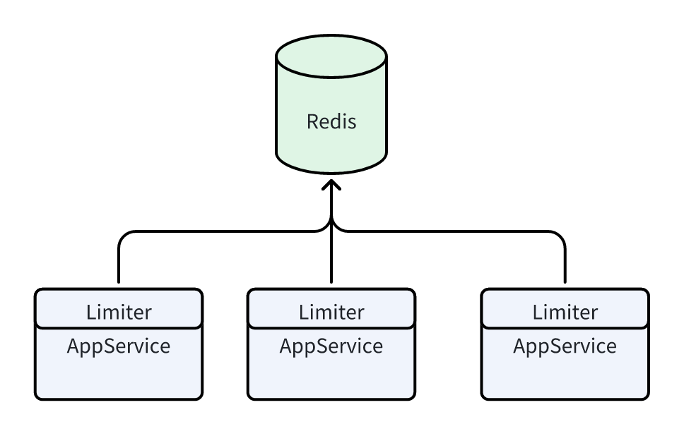
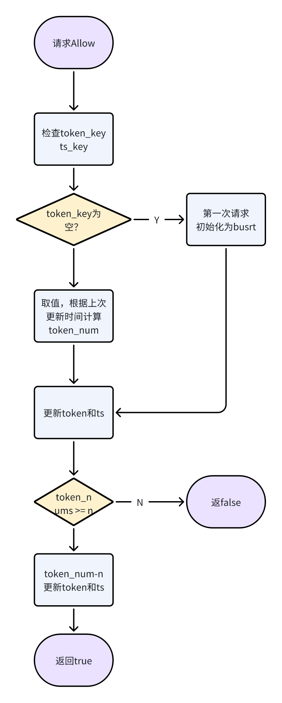

# RateLimiter 

## 需求

### 场景​
离线数据处理场景：一系列的离线数据处理的程序会通过上游获取数据的接口获取数据，该接口有限流保护策略，每分钟请求不超过60次，超过会抛出429错误。这些程序共享上述限流配额。​
MQ消费场景：消费MQ的程序向某数据库里写数据，该数据库配置较低，为确保该数据库不被打卦，写操作的限流QPS不能超过100。​

### 算法

####  算法比对
常见的限流算法主要有以下四种
1. 固定窗口
2. 滑动窗口
3. 漏桶算法
4. 令牌桶算法
这四种优缺点如下

|       |固定窗口 |滑动窗口 |漏桶 |令牌桶 |
| :----:| :---- | :---- |:---- |:---- |
| 优点 | 1. 简单，便于实现和理解 | 1. 相对简单  2. 精度高，可以解决临界问题 | 1. 可以平滑请求 2. 可以控制请求速率|1. 可以平滑请求 2. 可以处理突发流量 |
| 缺点 | 1. 存在临界问题 | 1. 无法处理突发流量 2. 不支持流量整形。 |1. 无法处理突发流量 2. 处理速率恒定，无法灵活调整 |1. 实现相对复杂 2. 时间精度要求高 |

#### 选型

1. 结合需求，我们需要限制qps保护下游服务，我们不希望存在临界问题，临界问题会导致实际请求达到预期的2倍，可能导致下游服务崩溃。因此固定窗口不满足当前场景需求。
   
2. 我们希望通过调整限流算法参数来实现控制请求速率，尽可能平滑请求，避免突发流量对下游造成太大冲击。因此漏桶算法也不满足当前场景需求。

虽然需求中没有直接处理突发流量的问题，但是作为一个公共pkg应该提供更多的功能，因此选择令牌桶作为最终算法。

### 概要设计

#### 思路

基于令牌桶算法限流，采用懒加载模式。即访问的时候才会更新token数量。

重点参数主要是每条添加token数和桶大小burst。

按照需求场景，假设每秒qps1000，也就是说桶最大为1000，每秒token数应该为1000。

另外采用懒加载模式，每次访问时根据上次访问时间算出要补充的token数。利用redis lua的原子性可以避免并发冲突的问题。

#### 架构

### 详细设计

#### 数据结构

RedisKey: 

1. TokenKey = ${name}_token  
    Value 当前令牌桶剩余token

2. TimestampKey = ${name}_ts 
Value 上一次刷新的时间

#### 流程设计

